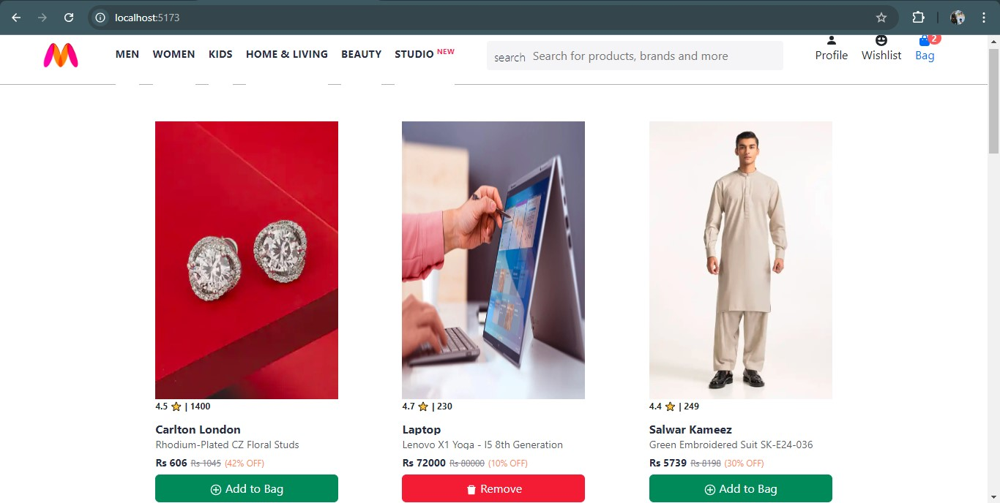
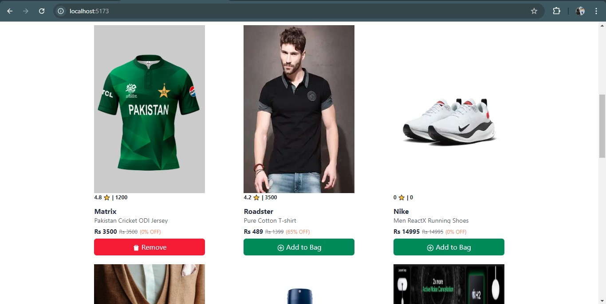
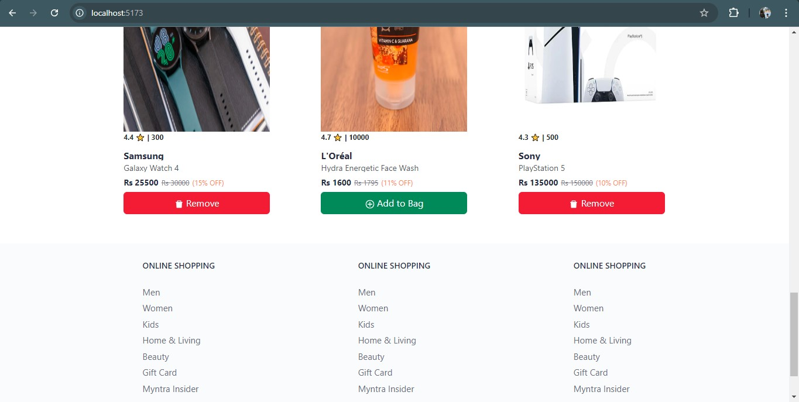
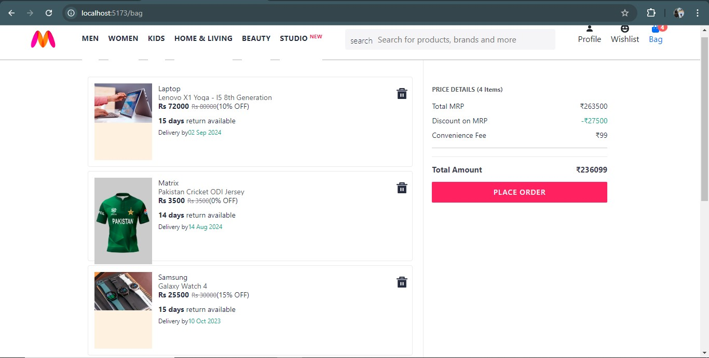

# Myntra-Clone

## Description

The **Myntra-Clone** project is a front-end application built using React.js and Redux, aimed at practicing and solidifying skills in these technologies. The project simulates an e-commerce platform where users can browse products, add items to a bag (similar to a shopping cart), and view a summary of their selections.

## Features

- **Product Selection**: Browse a selection of products.
- **Add to Bag**: Add or remove products from the bag, with the button dynamically changing between "Add" and "Remove."
- **Bag Component**: View and manage selected items in the bag, including the option to remove items.
- **Bill Calculation**: Automatically calculates and displays the total amount with discounts for all selected products.
- **Responsive Design**: Adaptable UI for different screen sizes.






## Technologies Used

- **React.js**: For building the user interface.
- **@reduxjs/toolkit**: For managing application state efficiently.
- **React Router**: For seamless navigation between components.
- **Bootstrap**: For responsive design and styling.
- **react-icons**: For integrating icons seamlessly into the application.
- **Vite**: For fast development and build process.

## Installation

### Prerequisites

- Node.js
- npm (Node Package Manager)

### Steps to Install

1. **Clone the Repository**:

   ```sh
   git clone https://github.com/Syed-Muhammad-Hussnain-Raza/Myntra-Clone.git
   ```

2. **Navigate to the Project Directory**:

   ```sh
   cd Myntra-Clone
   ```

3. **Navigate to the App Directory**:

   ```sh
   cd 3-myntra-react-clone/
   ```

4. **Install Dependencies**:

   ```sh
   npm install
   ```

### Setup

**The project is divided into two main folders:**

1. **Backend**: Contains the server that loads data from items.json and serves it to the front-end.

2. **3-myntra-react-clone**: Contains the main React code for the front-end, including the UI and state management logic.
   Run the backend server to serve data and then start the React app.

## Usage

**Ensure you are in the `Myntra-Clone` folder before proceeding.**

### 1. Start the Backend Server:

Navigate to the backend directory:

```sh
cd Backend
```

Start the server:

```sh
npm start
```

Keep this terminal **open** and the server running as long as you are using the **Myntra-Clone App**. The server must be active to ensure the front-end can fetch and display data properly.

### 2. Start the Myntra App :

In a separate terminal, navigate to the front-end directory

```sh
cd 3-myntra-react-clone
```

Start the app:

```sh
npm run dev
```

## Navigate in Myntra App

The navigation within the Myntra app is seamless, thanks to the integration of `react-router`. The app supports deep linking, allowing users to land directly on specific components.

For example, if the app is running on `http://localhost:5173/`, you can navigate directly to:

- **Home Component:** `http://localhost:5173/`
- **Bag Component:** `http://localhost:5173/bag`

These direct links make the app more user-friendly and improve the overall user experience.

## Learning Outcomes

- **React:** Gained a deeper understanding of building dynamic and interactive UIs.
- **Redux Toolkit:** Mastered state management with `@reduxjs/toolkit`, ensuring predictable state transitions and efficient state management.
- **Bootstrap:** Enhanced UI styling and responsiveness, ensuring a consistent look and feel across devices.
- **React Icons:** Integrated a variety of icons seamlessly into React components, improving the app's visual appeal.

## Future Enhancements

**Database Integration**: Plan to connect the application to a real database using SQL or NoSQL technologies.

**Deployment**: Aim to deploy the application on hosting platforms for public access.

## Acknowledgments

Special thanks to the following resources that were instrumental in developing this social media application:

### [React](https://react.dev/)

For providing essential guidelines and concepts crucial to building dynamic UIs.

### [Bootstrap](https://getbootstrap.com/docs)

For offering a robust collection of responsive UI components that enhanced the application's interface.

### [Redux Toolkit](https://redux-toolkit.js.org/)

For streamlining state management with reduced boilerplate and predictable state transitions.

### [React Icons](https://react-icons.github.io/react-icons/)

For seamlessly integrating a diverse range of icons into the user interface.

### [Vite](https://vitejs.dev/)

For enabling a fast and efficient development experience with its modern build tool and hot module replacement.

## Author

### **Syed Muhammad Hussnain Raza | [LinkedIn](https://www.linkedin.com/in/syed-muhammad-hussnain-raza/)**
